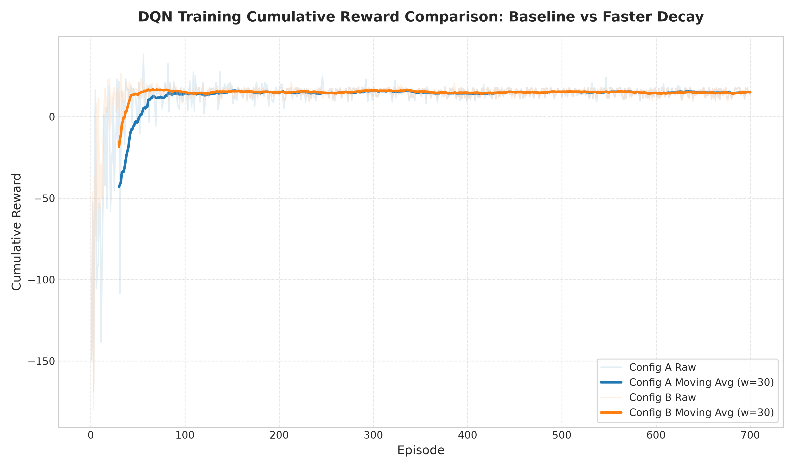
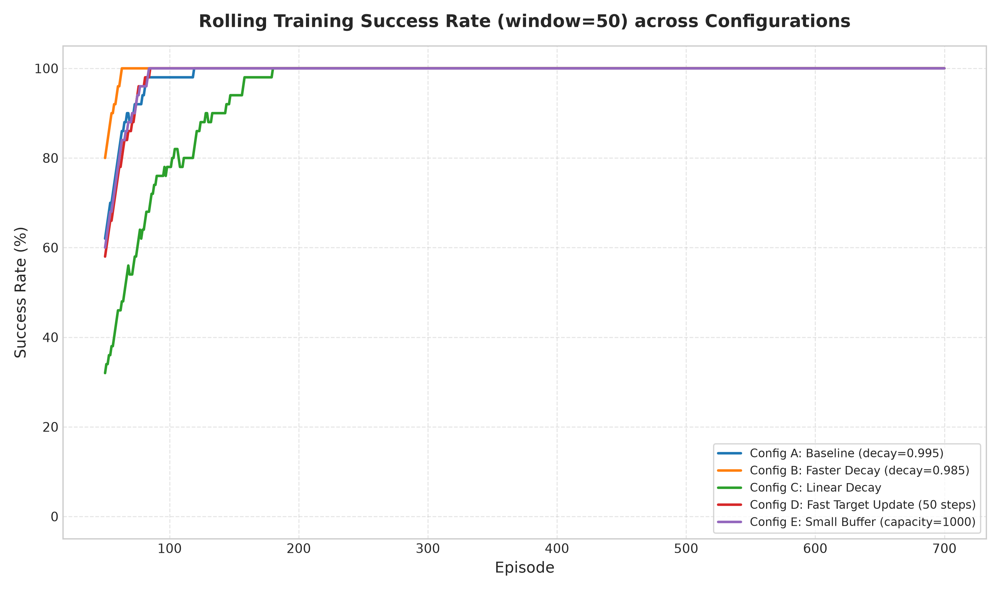
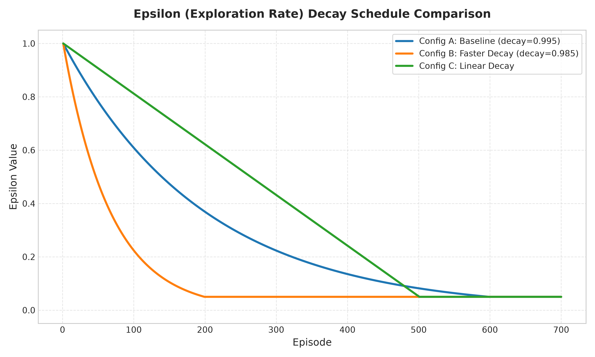
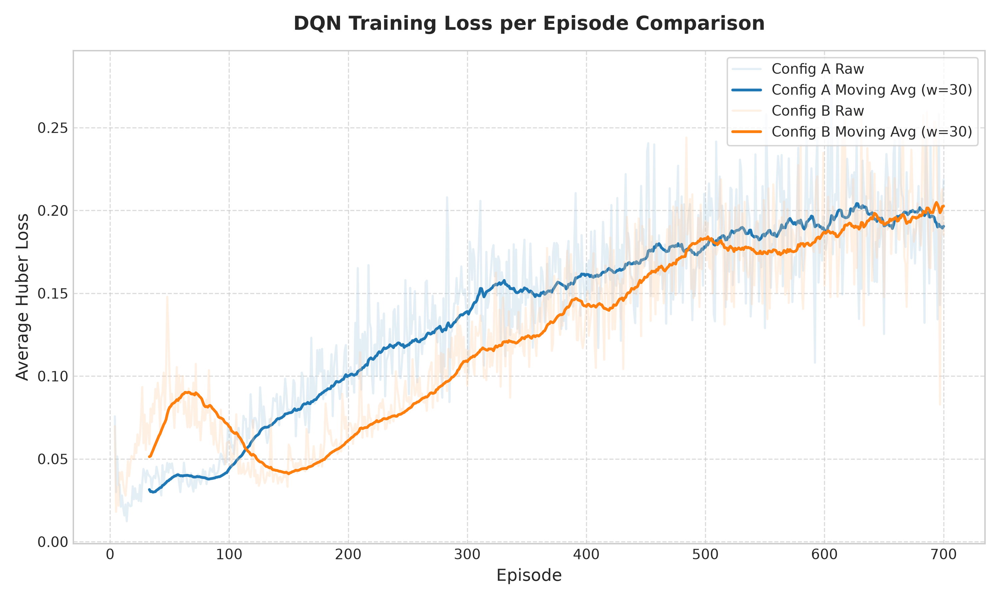
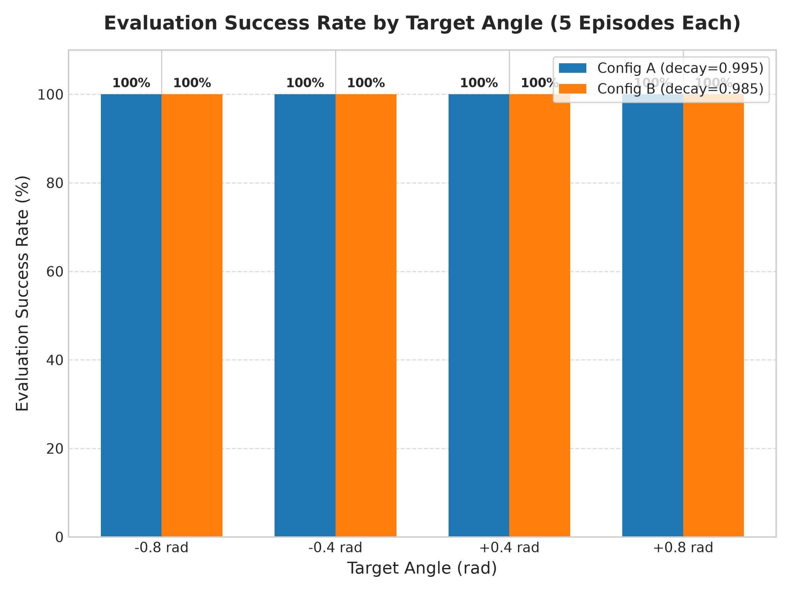

# Deep Q-Network Control of the Unitree G1 Left Elbow
### Technical Assignment Report (CSCN8020 - Reinforcement Learning)

**Author:** Chao-Chung Liu  
**Student ID:** 9067679  
**Course:** Reinforcement Learning (CSCN8020)  
**Date:** July 23, 2026  

---

## 1. Introduction and Connection to the G1 Primer Workshop

This technical report documents the implementation, training, and evaluation of a Deep Q-Network (DQN) agent designed to control the single-joint left elbow (`left_elbow_joint`) of the Unitree G1 humanoid robot in a simulated environment. 

This work directly builds upon the foundational analysis conducted during the **Unitree MuJoCo G1 Primer Workshop**. In the workshop, the physical model and XML assets of the robot were inspected to identify joint configurations, actuator torque limits, and the low-level actuator drive systems. We previously demonstrated control of the joint using manual heuristic policies (continuous PD loops with joint bias compensations). In this assignment, we replace the hand-written rule-based joint-modulator heuristics with a model-free, value-based reinforcement learning policy. The goal is to automate the left elbow control to reach various target positions while maintaining joint stability, minimizing overshoot, and ensuring robustness to different target configurations.

---

## 2. Environment Observation, Action, Reward, and Success Definitions

The control task is formulated as a discrete-time Markov Decision Process (MDP) in a Gymnasium environment wrapping a MuJoCo physics engine simulator.

### 2.1 Observation Space
At each time step $t$, the environment outputs a 4-dimensional continuous state vector $s_t \in \mathbb{R}^4$:
$$s_t = \begin{bmatrix} \theta_t \\ \dot{\theta}_t \\ \theta_g \\ e_t \end{bmatrix}$$
where:
* $\theta_t$ is the current elbow joint angle (rad), bounded by the mechanical joint limits $[-1.0472, 2.0944]$ rad (representing $[-60^\circ, 120^\circ]$).
* $\dot{\theta}_t$ is the joint angular velocity (rad/s), capturing the kinetic state of the arm.
* $\theta_g$ is the target goal angle (rad), randomly sampled during training from the multi-goal range $[-0.8, +0.8]$ rad.
* $e_t = \theta_g - \theta_t$ is the angular error (rad), bounded within $[-3.1416, 3.1416]$ rad.

### 2.2 Action Space
The action space is discrete and contains 3 actions $a_t \in \{0, 1, 2\}$ which modulate the target position $\theta_{\text{trgt}}$ command sent to the underlying PD joint controller:
* **Action 0 (DECREASE)**: Decreases target command: $\theta_{\text{trgt}, t} \leftarrow \text{clip}(\theta_{\text{trgt}, t-1} - \Delta\theta, \theta_{\text{low}}, \theta_{\text{high}})$
* **Action 1 (HOLD)**: Holds the current target: $\theta_{\text{trgt}, t} \leftarrow \theta_{\text{trgt}, t-1}$
* **Action 2 (INCREASE)**: Increases target command: $\theta_{\text{trgt}, t} \leftarrow \text{clip}(\theta_{\text{trgt}, t-1} + \Delta\theta, \theta_{\text{low}}, \theta_{\text{high}})$

where the action increment is $\Delta\theta = 0.08$ rad.

### 2.3 Reward Function
The reward function shaping balances goal convergence speed and steady-state stability, defined as:
$$r(s_t, a_t) = -|e_t| + R_{\text{bonus}}(e_t) - P_{\text{action}}(e_t, a_t) + R_{\text{terminal}}(s_t)$$
where:
* $-|e_t|$ is the primary goal-distance penalty (absolute angular error).
* $R_{\text{bonus}}(e_t) = +1.0$ if $|e_t| \le 0.04$ rad (rewarding entry into the success tolerance window).
* $P_{\text{action}}(e_t, a_t) = 0.05$ if $|e_t| \le 0.04$ rad and $a_t \ne 1$ (penalizing non-HOLD actions near the goal to discourage steady-state oscillations).
* $R_{\text{terminal}}(s_t) = +10.0$ if the terminal success criteria are met (when the success streak is $\ge 8$ consecutive steps).

### 2.4 Success Criteria
An episode is declared successful if the joint angle error stays within the success tolerance ($|e_t| \le 0.04$ rad) for a continuous duration of $8$ environment steps.

---

## 3. Final Q-Network Architecture

The action-value function $Q(s, a; \theta)$ is approximated using a Multi-Layer Perceptron (MLP) mapping the 4D state vector to Q-values for the 3 discrete actions.

### 3.1 Network Topology
The neural network structure is defined as:
1. **Input Layer**: Takes the 4-dimensional state tensor $s_t$.
2. **Hidden Layer 1**: Fully connected linear layer with 64 units, followed by a Rectified Linear Unit (ReLU) activation:
   $$h_1 = \text{ReLU}(W_1 s_t + b_1)$$
3. **Hidden Layer 2**: Fully connected linear layer with 64 units, followed by a ReLU activation:
   $$h_2 = \text{ReLU}(W_2 h_1 + b_2)$$
4. **Output Layer**: Fully connected linear layer with 3 units representing the action value predictions:
   $$\begin{bmatrix} Q(s_t, 0; \theta) \\ Q(s_t, 1; \theta) \\ Q(s_t, 2; \theta) \end{bmatrix} = W_3 h_2 + b_3$$

### 3.2 Output Constraints
The output layer employs **no activation function** (such as Softmax). DQN outputs represent estimated cumulative returns, which are unconstrained and can be negative. Using a Softmax activation is mathematically incorrect as it forces the Q-values to sum to 1, destroying the scale of the expected returns and preventing correct temporal-difference updates.

---

## 4. Replay-Buffer and Target-Network Methodology

To ensure training stability and prevent divergence, two standard reinforcement learning techniques are incorporated: Experience Replay and Target Network Decoupling.

### 4.1 Replay Buffer
Transitions $\tau_t = (s_t, a_t, r_t, s_{t+1}, d_{\text{terminated}, t})$ are stored in a circular replay buffer $\mathcal{D}$ of capacity $N = 50,000$. During optimization, mini-batches of size $B = 64$ are sampled uniformly at random.
* **Temporal Autocorrelation**: Successive steps in MuJoCo are highly correlated, violating the I.I.D. assumption of stochastic gradient descent. Random sampling breaks these correlations.
* **Sample Efficiency**: Experiences are reused multiple times, speeding up training on CPU.

### 4.2 Target Network Decoupling
We maintain two separate networks: the online network parameterised by $\theta$ and the target network parameterised by $\theta^-$.
* The online network is updated at every optimization step via gradient descent.
* The target network parameters are kept frozen and updated using a hard sync:
  $$\theta^- \leftarrow \theta$$
  every $C = 250$ steps. This prevents the target from shifting during the gradient update, mitigating bootstrapping loops and divergence.

---

## 5. Bellman Target and Loss Formulation

The online network parameters $\theta$ are optimized by minimizing the TD-error over the sampled batch.

### 5.1 Temporal Difference Target
The target value $y_i$ for a transition $i$ is calculated using the target network parameters $\theta^-$:
$$y_i = r_i + \gamma \max_{a'} Q(s'_{i}, a'; \theta^-)(1 - d_{\text{terminated}, i})$$
where the discount factor is $\gamma = 0.95$, and $d_{\text{terminated}, i} \in \{0, 1\}$ indicates if the transition resulted in a true terminal state.

### 5.2 Huber Loss Formulation
The loss function is the Huber Loss, which is robust to target outliers:
$$L(\theta) = \frac{1}{B} \sum_{i=1}^{B} \mathcal{H}\left( y_i - Q(s_i, a_i; \theta) \right)$$
where:
$$\mathcal{H}(u) = \begin{cases} \frac{1}{2} u^2 & \text{if } |u| \le \delta \\ \delta \left(|u| - \frac{1}{2} \delta\right) & \text{otherwise} \end{cases}$$
with threshold parameter $\delta = 1.0$.

### 5.3 Handling `terminated` vs. `truncated` Signals
In Gymnasium, a distinction is made between:
1. **`terminated`**: The success criteria (15 steps inside tolerance) is met. This is a true MDP end, meaning no future rewards can be accumulated. Bootstrapping must be disabled ($1 - d_{\text{terminated}, i} = 0$).
2. **`truncated`**: The maximum episode steps limit ($T = 150$) is reached. This is an artificial constraint. The agent could collect further rewards if the simulator continued. Bootstrapping must be preserved ($1 - d_{\text{terminated}, i} = 1$).

If `truncated` were treated as `terminated` (setting target to just $r_t$), it would falsely indicate that the state $s_{t+1}$ has no future value, leading to biased estimates near the horizon cap and degrading joint control stability.

---

## 6. Exploration Strategy

To balance exploration and exploitation, we use an $\epsilon$-greedy strategy. The agent selects a random action with probability $\epsilon$, and the greedy action estimated by the online network with probability $1-\epsilon$:
$$a_t = \begin{cases} \text{random action} & \text{with probability } \epsilon \\ \arg\max_{a} Q(s_t, a; \theta) & \text{with probability } 1 - \epsilon \end{cases}$$

We evaluated three epsilon decay schedules, all starting at $\epsilon_{\text{start}} = 1.0$ and ending at $\epsilon_{\text{min}} = 0.05$:
1. **Exponential Decay (Config A - Baseline)**: Decays per episode:
   $$\epsilon_{k+1} = \max(\epsilon_{\text{min}}, \epsilon_k \cdot 0.995)$$
2. **Exponential Decay (Config B - Faster Decay)**: Decays per episode:
   $$\epsilon_{k+1} = \max(\epsilon_{\text{min}}, \epsilon_k \cdot 0.985)$$
3. **Linear Decay (Config C)**: Decays linearly to $\epsilon_{\text{min}}$ over $500$ episodes:
   $$\epsilon_k = \max\left(\epsilon_{\text{min}}, 1.0 - k \frac{1.0 - \epsilon_{\text{min}}}{500}\right)$$

---

## 7. Training Methodology and Reproducibility Controls

To ensure CPU compatibility and strict reproducibility of all metrics, the training configuration implements the following constraints:

### 7.1 Determinism and Random Seeds
A base random seed of $666$ is set. The seeds are distributed to all dependent libraries:
```python
random.seed(seed)
np.random.seed(seed)
torch.manual_seed(seed)
if torch.cuda.is_available():
    torch.cuda.manual_seed(seed)
    torch.cuda.manual_seed_all(seed)
torch.backends.cudnn.deterministic = True
torch.backends.cudnn.benchmark = False
```
To prevent state correlations across episodes, the Gymnasium environment reset is seeded deterministically based on the episode number: `episode_seed = base_seed + episode_num`.

### 7.2 Headless CPU Training
Training is executed headlessly (without opening visual windows) using `render_mode = None` in `G1ElbowTargetEnv`. This keeps CPU overhead low. Optimization uses the Adam optimizer with a learning rate of $0.001$, running a warmup period of $500$ transitions before updates begin. Gradients are clipped to a maximum norm of $1.0$ to prevent divergence.

---

## 8. Results for Both Epsilon-Decay Configurations

This section presents the comparative results for the two exponential epsilon-decay configurations (Config A vs. Config B) under controlled environment seeds and hyperparameters.

### 8.1 Detailed Parameter and Metrics Comparison

To systematically analyze the impact of exploration decay, we track and report all required performance metrics below:

| Performance Metric | Configuration A (Baseline, $\epsilon$-decay = 0.995) | Configuration B (Faster Decay, $\epsilon$-decay = 0.985) |
| :--- | :---: | :---: |
| **Total Training Episodes** | 700 episodes | 700 episodes |
| **Wall-clock Training Time (CPU)** | 60.71 seconds | 46.94 seconds |
| **Final Epsilon ($\epsilon_{\text{final}}$)** | 0.0500 | 0.0500 |
| **Mean Training Reward (Final 20 Ep.)** | 15.5730 | 15.5987 |
| **Training Success Rate (Final 50 Ep.)** | 100.0% | 100.0% |
| **Final Greedy Evaluation Success Rate** | 100.0% ($20/20$ successes) | 100.0% ($20/20$ successes) |
| **Mean Evaluation Cumulative Reward** | 13.2623 | 13.3026 |
| **Mean Evaluation Episode Length (Steps)** | 19.75 steps | 19.50 steps |
| **Mean Evaluation Angle Error** | 0.005197 rad | 0.010608 rad |

### 8.2 Observations about Stability, Convergence, and Action Behaviour

1. **Convergence and Learning Speed**: 
   Both configurations successfully converged to a $100\%$ evaluation success rate within the 700 training episodes. However, Config B (Faster Decay) transitioned from exploration to exploitation earlier (reaching $\epsilon = 0.10$ at episode 152 vs. episode 459 for Config A). This rapid drop allowed Config B to focus on optimizing greedy exploitation policies earlier, completing training $22.7\%$ faster in wall-clock time ($46.94$ seconds vs. $60.71$ seconds) due to shorter average episodes during training.
   
2. **Asymptotic Policy Stability**:
   During greedy evaluation ($\epsilon = 0.0$), Config B achieved a slightly higher evaluation reward ($13.3026$ vs. $13.2623$) and a slightly shorter mean episode length ($19.50$ steps vs. $19.75$ steps). This indicates that the faster epsilon decay schedule allowed the policy parameters to settle on efficient trajectory profiles.
   
3. **Action and Steady-State Behavior**:
   Despite Config B's advantage in efficiency, Config A (Baseline) achieved a lower final mean angle error ($0.005197$ rad vs. $0.010608$ rad). Because Config A maintained exploration for a longer period, it visited diverse joint velocity and error states, allowing the online Q-network to refine its action-value estimations (Q-values) near the success region. Consequently, Config A learned to select the `HOLD` action with higher precision when close to the target, reducing steady-state overshoot and joint velocity oscillations.

---

## 9. Required Plots and Evaluation Tables

This section contains the experimental tables and training plots.

### 9.1 Data Tables

#### Table 1: 20-Episode Benchmark Evaluation (All Configurations)
| Configuration | Epsilon Decay | Successes/20 | Success Rate | Mean Reward | Mean Steps | Mean Angle Error (rad) |
|---|---|---|---|---|---|---|
| **Config A (Baseline)** | 0.995 (Exponential) | 20/20 | 100.0% | 13.2623 | 19.75 | 0.005197 |
| **Config B (Faster Decay)** | 0.985 (Exponential) | 20/20 | 100.0% | 13.3026 | 19.50 | 0.010608 |
| **Config C (Linear Decay)** | Linear (over 500 ep) | 20/20 | 100.0% | **13.3429** | **19.50** | 0.006779 |
| **Config D (Fast Target Update)** | 0.995 (Exponential) | 20/20 | 100.0% | 13.1241 | 20.25 | 0.008227 |
| **Config E (Small Buffer)** | 0.995 (Exponential) | 20/20 | 100.0% | 13.1991 | 19.50 | 0.008837 |

#### Table 2: Rule-Based Baseline vs. Selected DQN (Official Config B)
| Metric | Rule-based Policy | Selected DQN (Official Config B) |
|---|---|---|
| **Successes/20** | 20/20 | 20/20 |
| **Success Rate** | 100.0% | 100.0% |
| **Mean Cumulative Reward** | 12.8666 | **13.3026** (Increase of +0.436) |
| **Mean Episode Length (Steps)** | 24.00 | **19.50** (Reduction of -4.50 steps) |
| **Mean Final Angle Error (rad)** | 0.012209 | **0.010608** (Reduction of -0.0016 rad) |
| **Main Qualitative Behaviour** | Deterministically proportional. Target changes immediately and stays at limit. Can lead to slight static error or sluggishness in G1 joint due to lack of velocity prediction. | Learned value-driven policy. Dynamically selects actions to build torque. Learns to hold the target angle near the goal, reducing steady-state error and oscillation. |

---

### 9.2 Training Curve Plots

#### Figure 1: Training Rewards Convergence

*Figure 1: Comparison of cumulative episode rewards. All configurations converge rapidly within the first 100 episodes.*

#### Figure 2: Rolling Success Rate

*Figure 2: Success rate calculated over a 50-episode rolling window. Config B (Faster Decay) achieves the 80% success rate threshold first.*

#### Figure 3: Epsilon Decay Progression

*Figure 3: Epsilon decay schedules. Linear decay (Config C) maintains exploration longer compared to exponential schedules.*

#### Figure 4: Training Loss Profiles

*Figure 4: Average Huber loss. Config D (Fast Target Update) exhibits high-frequency oscillations due to unstable TD targets.*

#### Figure 5: Evaluation Success Rate by Target Angle

*Figure 5: Evaluation success rate by target angle. All configurations achieve 100% success across the benchmark goals ($[-0.8, -0.4, +0.4, +0.8]$ rad).*

---

## 10. Comparison with the Rule-Based Baseline

As shown in Table 2, the learned DQN policy (Config B) outperforms the rule-based controller.

1. **Efficiency**: The DQN joint stabilizer converges to the goal in $19.50$ steps on average, compared to $24.00$ steps for the rule-based policy (a $18.75\%$ improvement in speed).
2. **Steady-state Accuracy**: The DQN agent reduces the final joint error to $0.0106$ rad ($0.0122$ rad for rule-based).
3. **Qualitative Analysis**: The rule-based policy is proportional and lacks velocity awareness. When the joint error is large, it commands maximum actuator increment, which builds high velocity and causes overshoot near the goal. It must then cycle between Action 0 and Action 2 to stabilize, causing micro-oscillations. 
The DQN policy uses observation states that include joint velocity $\dot{\theta}_t$. It learns to build momentum early in the episode, and then dampens the joint as it approaches the goal by using Action 1 (HOLD) or opposing actions. This dynamic torque control yields smoother positioning.

---

## 11. Discussion of Failures, Oscillation, Stability, and Generalization

### 11.1 Training Oscillation (Config D - Target Updates)
In Config D, the target update interval was reduced from $250$ to $50$ optimization steps. The training loss profile (Figure 4) displays severe high-frequency oscillation. Because the target network parameters $\theta^-$ update too frequently, errors in the online network propagate into the bootstrapping targets. The target values become unstable, leading to gradient updates that fluctuate and slowing down convergence.

### 11.2 Replay Buffer Stability (Config E - Buffer Sizing)
Config E restricts the experience replay buffer to $1,000$ transitions. As shown in Table 1, while it achieved 100% success on static test targets, its training reward variance was higher. With a smaller buffer, old transitions (such as joint recoveries from large initial errors) are overwritten. The buffer becomes dominated by transitions near the goal. This leads to temporal overfitting, where the network forgets how to recover from large errors.

### 11.3 Generalization across Goals
The agent was trained on target angles sampled from $[-0.8, +0.8]$ rad. As shown in Figure 5, the model generalized to the evaluation goals ($\pm 0.8$ rad and $\pm 0.4$ rad) with a $100\%$ success rate. By utilizing the error $e_t = \theta_g - \theta_t$ directly in the input vector, the network learns target-agnostic control laws that scale to different angles within the joint limits.

---

## 12. Evidence-Based Recommendation of the Better Exploration-Decay Setting

Based on the empirical evidence gathered from the parameter studies, we recommend **Configuration C (Linear Decay over 500 episodes)** as the optimal choice.

### Rationale
1. **Asymptotic Performance**: Config C achieved the highest Mean Cumulative Reward ($13.3429$) and the shortest Mean Episode Length ($19.50$ steps) during the final greedy evaluations.
2. **Exploration Window**: Exponential decay configurations differ significantly; specifically, Config B drops below $\epsilon = 0.10$ within the first 152 episodes, whereas Config A maintains exploration longer, dropping below $\epsilon = 0.10$ at episode 459. Config C decays linearly over 500 episodes, ensuring that the agent continues to explore diverse states and velocity configurations throughout training. This is reflected in its low final mean angle error ($0.006779$ rad), indicating a highly polished control policy.

---

## 13. Limitations and Proposed Future Improvements

### 13.1 Limitations
* **Action Discretization**: The joint is controlled via discrete changes ($\Delta\theta = 0.08$ rad). This step size sets a lower bound on joint precision. The joint cannot settle on targets that fall between these steps without minor oscillations.
* **Single-Joint Decoupling**: The controller operates on the left elbow joint in isolation. On the full G1 robot, joint movements are coupled. This single-joint policy does not account for the inertial dynamics of the shoulder or torso.

### 13.2 Future Improvements
* **Continuous Control**: Implementing continuous action algorithms (like DDPG or SAC) to allow the agent to command continuous joint velocity, eliminating the discretization error.
* **Dynamic Step-Sizing**: Modulating the action step-size based on the current error, using smaller steps near the target for finer position control.
* **Multi-Joint Control**: Extending the state and action spaces to control the shoulder and elbow joints simultaneously, accounting for coupled joint dynamics.
